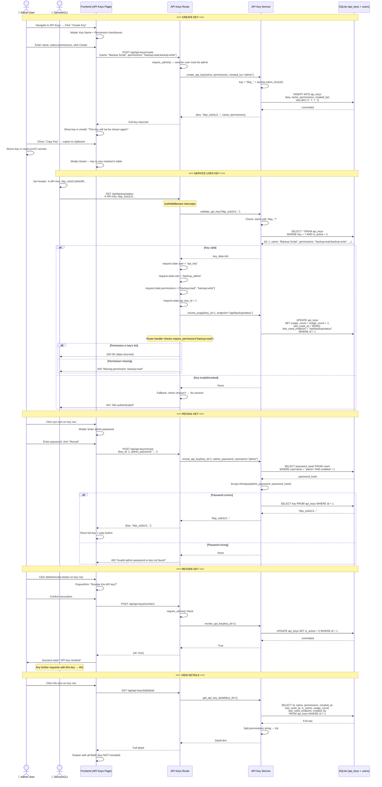

# API Key Authentication Flow

## Overview

API keys provide programmatic access to the SeaweedFS Dashboard for automation, CI/CD pipelines, and service-to-service communication. Keys use the `X-API-Key` HTTP header and bypass session/cookie-based auth entirely. Each key is assigned granular permissions at creation time, and usage is tracked (count, last used timestamp, last endpoint).

Keys are generated with the prefix `bkp_` followed by 64 hex characters (`secrets.token_hex(32)`). The full key is shown exactly once at creation time and stored as-is (not hashed) in the `api_keys` table — unlike user passwords which use bcrypt.

## Key Management Lifecycle



## Permission Model

### Available Permissions

Permissions are checked as exact string matches against the comma-separated values stored in the `api_keys.permissions` column.

| Permission String | Controls Access To |
|---|---|
| `backup:read` | `GET /api/backup/status`, `GET /api/backup/snapshots` |
| `backup:write` | `POST /api/backup/sync`, `POST /api/backup/snapshots`, `DELETE /api/backup/snapshots/{name}`, `POST /api/backup/restore/{name}` |
| `filer:read` | `GET /api/filer/list/*` |
| `filer:write` | `POST /api/filer/mkdir/*`, `DELETE /api/filer/delete/*`, `POST /api/filer/upload/*` |
| `s3:read` | `GET /api/s3/buckets`, `GET /api/s3/users`, `GET /api/s3/policies` |
| `s3:write` | `POST /api/s3/buckets`, `DELETE /api/s3/buckets`, `POST /api/s3/users`, etc. |
| `workers:read` | `GET /api/workers/status`, `GET /api/workers/jobs` |
| `workers:execute` | `POST /api/workers/jobs/detect`, `POST /api/workers/jobs/execute` |

### Permission Check Logic

In `auth_middleware.py`, the `require_permission()` function handles two paths:

1. **API key user** (`request.state.role == "backup_admin"`):
   - Checks if the required permission string exists in `request.state.permissions` (list derived from the key's DB record)
   - Returns `403` if the permission is not in the list

2. **Session user** (roles like `admin`, `readonly`):
   - Delegates to `rbac.has_permission(role, permission)` which checks the `rbac.json` mapping

### Multiple Permissions Per Key

A key can hold multiple permissions simultaneously (e.g., `"backup:read,backup:write,filer:read"`). The frontend uses Ant Design `Checkbox.Group` with the following options:

```typescript
const PERMISSION_OPTIONS = [
  { label: 'Backup Read',   value: 'backup:read' },
  { label: 'Backup Write',  value: 'backup:write' },
  { label: 'Filer Read',    value: 'filer:read' },
  { label: 'Filer Write',   value: 'filer:write' },
  { label: 'S3 Read',       value: 's3:read' },
  { label: 'S3 Write',      value: 's3:write' },
  { label: 'Workers Read',  value: 'workers:read' },
  { label: 'Workers Execute', value: 'workers:execute' },
]
```

## Key Format and Generation

```python
# backend/app/services/api_key_service.py
def generate_key() -> str:
    return "bkp_" + secrets.token_hex(32)
```

| Property | Value |
|---|---|
| **Prefix** | `bkp_` (used by `validate_api_key` to reject non-backup keys) |
| **Random portion** | 64 hex characters (32 bytes of entropy via `secrets.token_hex(32)`) |
| **Total length** | 68 characters |
| **Example** | `bkp_a1b2c3d4e5f6a7b8c9d0e1f2a3b4c5d6e7f8a9b0c1d2e3f4a5b6c7d8e9f0a1b2` |

## Usage Tracking

Every API key request triggers `record_usage()` which updates:

```sql
UPDATE api_keys
SET usage_count = usage_count + 1,
    last_used_at = '<ISO 8601 timestamp>',
    last_used_endpoint = '/api/backup/status'
WHERE id = <key_id>
```

This allows administrators to:
- See which keys are actively used vs dormant
- Identify the last endpoint each key accessed
- Monitor usage patterns for suspicious activity
- Decide whether to revoke unused keys

## Key Visibility and Security

| State | Visibility | How to Access |
|---|---|---|
| **At creation** | Full key shown once | Modal with copy button |
| **In table (routine)** | Masked: `bkp_a1b2...` (first 8 chars) | API Keys list page |
| **In detail drawer** | Key NOT shown | Click info icon |
| **Reveal** | Full key after admin password verification | Eye icon → password prompt → bcrypt check |
| **After revocation** | Still masked in list | Marked with red "Revoked" tag |
| **In localStorage** | Stored as plain text when user enters it | Browser DevTools → Application → Local Storage |

### Reveal Security

The reveal endpoint requires:
1. The requesting user's session to be valid (logged in)
2. The user's admin password (`bcrypt.checkpw`) to match their stored hash
3. The API key to exist

This ensures that even if a session is hijacked, the attacker cannot reveal API keys without the admin's password.

## Revocation

Revocation is a **soft delete** — the `is_active` column is set to `0`. The key remains in the database for audit purposes but is rejected by `validate_api_key()`:

```python
async def validate_api_key(key: str) -> dict | None:
    db = await get_db()
    cursor = await db.execute(
        "SELECT * FROM api_keys WHERE key = ? AND is_active = 1", (key,)
    )
    row = await cursor.fetchone()
    return dict(row) if row else None
```

Revoked keys:
- Return `401` on any future request
- Remain visible in the API Keys list with a red "Revoked" tag
- Can be viewed in detail but cannot be revealed or re-activated

## Comparison: Session Auth vs API Key Auth

| Aspect | Session Auth | API Key Auth |
|---|---|---|
| **Trigger** | Browser cookie (auto-sent) | `X-API-Key` header (explicit) |
| **Identity** | `request.session["user"]` | `request.state.user = "api_key"` |
| **Role** | `admin` or `readonly` (from session) | Always `backup_admin` |
| **Permissions** | RBAC (`rbac.json` role mapping) | Explicit list from `api_keys.permissions` |
| **CSRF** | Required for state-changing requests | Not required (key is bearer token) |
| **Expiry** | Browser-session lifetime | Permanent (until revoked) |
| **Use case** | Interactive dashboard users | Automation scripts, CI/CD, S3 clients |
| **Storage** | HttpOnly cookie + localStorage | `localStorage` (frontend) / env vars (CLI) |
