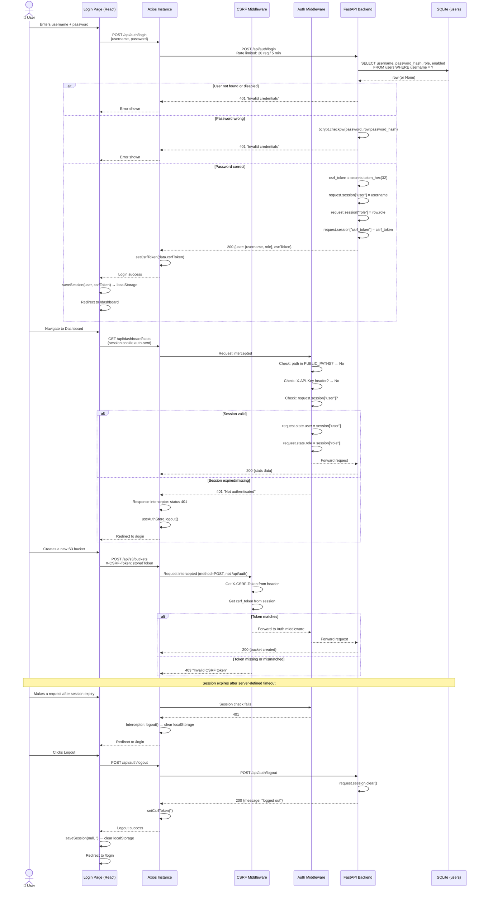
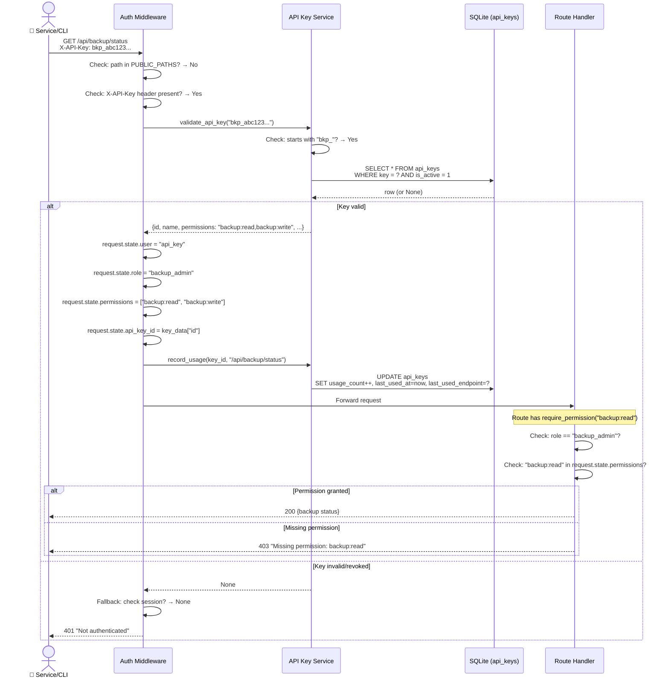

# Authentication Flow

## Overview

The SeaweedFS Dashboard uses a dual authentication strategy: **session-based auth** for browser users (with cookies and CSRF tokens) and **API key auth** for programmatic/service access via the `X-API-Key` header. Both paths hit the same `AuthMiddleware`, which resolves identity and performs RBAC checks.

## Session-Based Auth Flow



## API Key Auth Flow



## Auth Resolution Priority

The `AuthMiddleware` resolves identity in this order:

| Priority | Method | Role Assigned | Permissions Source |
|---|---|---|---|
| 1 | Public paths (`/api/health`, `/api/info`, `/api/auth/login`, `/api/auth/csrf-token`, `/docs`, `/openapi.json`) | None (bypass) | N/A |
| 2 | `X-API-Key` header (starts with `bkp_`) | `backup_admin` | `api_keys.permissions` field (comma-separated) |
| 3 | Session cookie (`request.session["user"]`) | From session (`admin` / `readonly`) | `rbac.json` role-to-permissions mapping |

**Public paths** (`backend/app/middleware/auth_middleware.py`):
```
/api/health, /api/info, /api/auth/login, /api/auth/csrf-token, /docs, /openapi.json
```

## CSRF Protection

The `CsrfMiddleware` (`backend/app/middleware/csrf_middleware.py`) applies to all state-changing requests:

| Aspect | Detail |
|---|---|
| **Safe methods** (bypassed) | `GET`, `HEAD`, `OPTIONS` |
| **Also bypassed** | `/api/auth/*` paths (login/logout need no prior session) |
| **Checked methods** | `POST`, `PUT`, `DELETE`, `PATCH` |
| **Header checked** | `X-CSRF-Token` |
| **Expected value** | `request.session["csrf_token"]` (set at login) |
| **On mismatch** | HTTP `403` — "Invalid CSRF token" |

The CSRF token is a hex string generated via `secrets.token_hex(32)` (64 hex chars). It is:

1. Created at login and stored in the server session
2. Returned in the login response body
3. Stored in the frontend's `localStorage` (via Zustand `authStore`)
4. Attached by Axios request interceptor to all non-GET/HEAD/OPTIONS requests

## Session Lifecycle

| Event | Action |
|---|---|
| **Login** | Session created server-side with `user`, `role`, `csrf_token`. Cookie sent to browser. |
| **Page refresh** | Frontend calls `GET /api/auth/me` + `GET /api/auth/csrf-token` to rehydrate session. |
| **401 response** | Axios interceptor calls `useAuthStore.getState().logout()` — clears localStorage, redirects. |
| **Logout** | `POST /api/auth/logout` → `request.session.clear()`. Frontend clears localStorage. |
| **Expiry** | Starlette `SessionMiddleware` default cookie lifetime (browser-session). Server-side invalidation on expiry. |

## RBAC Permissions

Role-based access control is defined in `backend/rbac.json`. Session users get permissions mapped from their role:

| Role | Typical Permissions |
|---|---|
| `admin` | `cluster:read`, `cluster:write`, `volumes:read`, `volumes:write`, `filer:read`, `filer:write`, `s3:read`, `s3:write`, `backup:read`, `backup:write`, `workers:read`, `workers:execute`, `settings:read`, `settings:write`, `users:read`, `users:write`, `disk_health:read` |
| `readonly` | Read-only variants of all the above |
| `backup_admin` (API key) | Determined by the API key's `permissions` field, not RBAC |

Permission checks in routes use `Depends(require_permission("resource:action"))` which internally:
1. For `backup_admin` role: checks the permission string against `request.state.permissions` list
2. For session roles: delegates to `rbac.has_permission(role, permission)`

## Rate Limiting

Applied via slowapi. The login endpoint is protected with:

```
@limiter.limit("20/5minute")
```

Allowing 20 attempts per 5-minute window per client IP. Exceeding this returns HTTP `429 Too Many Requests`.
