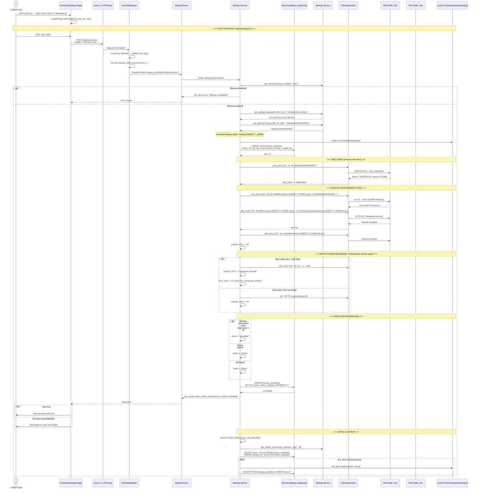
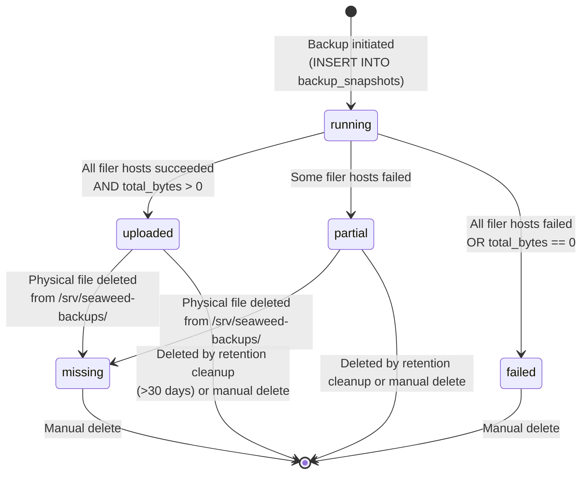

# Backup Flow

## Overview

The backup system creates full snapshots of the SeaweedFS Filer's LevelDB metadata database. It connects to filer nodes via SSH, tars the filer database directory, transfers the archive via SFTP to the dashboard server, and records the backup in SQLite. Old backups are automatically cleaned up based on retention settings.

**Important**: Backups capture filer metadata only — file/directory names, paths, sizes, permissions, timestamps, and directory structure. File content is stored separately on volume servers and is not included in filer backups.

## Backup Creation Flow



## Status Transitions



## Step-by-Step Explanation

### 1. API Key Entry
The user enters their backup API key (format: `bkp_<64-hex-chars>`) on the Backup page. The key is stored in `localStorage` under `backup_api_key`. The Axios request interceptor detects backup-related URLs (`/backup/`) and attaches the `X-API-Key` header automatically.

### 2. Permission Check
The `AuthMiddleware` validates the API key against the `api_keys` table (`is_active=1`), sets `request.state.role = "backup_admin"` and `request.state.permissions` from the key's permissions field. The route uses `Depends(require_permission("backup:write"))` to gate the operation.

### 3. Configuration Lookup
`create_backup()` fetches settings from the `runtime_settings` SQLite table (cached by `settings_service`):
- `backup_enabled` — must be `"true"`, otherwise operation is refused
- `seaweedfs_filer_host` — comma-separated list of filer hosts (defaults from `.env`/`config.py`)
- `backup_filer_db_path` — path to filer LevelDB on each filer node (default: `/data/dc03/filer/filerldb2`)

### 4. Filer Host Resolution
IP addresses are extracted from host strings (e.g., `10.10.95.102:8888` → `10.10.95.102`). SSH connections are made to port 22.

### 5. Size Measurement
Before backing up, `du -sb <db_path>` is run on the first filer node to get the raw byte count. This is logged and stored as `size_bytes`. If this command fails, the backup continues but `total_bytes` remains 0, resulting in `status="failed"`.

### 6. Tar Creation (On Each Filer)
For each filer host:
- `tar czf /tmp/filer-backup-{timestamp}.tar.gz -C {db_path} .` compresses the LevelDB directory.
- The `-C` flag changes to the db directory before archiving, so the archive root is `.` (relative paths).
- Uses gzip compression (`-z`).

### 7. SFTP Download
The tar.gz file is downloaded from the filer node to `/srv/seaweed-backups/{name}.tar.gz` via SFTP (paramiko's `sftp.get`). All filer backups go into the same archive file (sequential from first node). The temporary file on the filer node is deleted after download.

### 8. Database Record
A row is inserted into `backup_snapshots` with:
- `name` — backup identifier (e.g., `backup-20260717_143052` or user-provided name)
- `s3_key` — full path to the local `.tar.gz` file
- `filer_hosts` — JSON array of filer hostnames used
- `status` — starts as `"running"`, updated to `"uploaded"`, `"partial"`, or `"failed"` after completion
- `size_bytes` — total raw bytes measured
- `created_at` — ISO 8601 timestamp

### 9. Cleanup (Async)
After the backup completes, `cleanup_old_backups()` runs as an `asyncio.create_task()` background task. It:
1. Reads `backup_retention_days` from runtime settings (default: 30)
2. If retention is 0 or disabled, skips cleanup
3. Finds all `uploaded` backups older than the cutoff date
4. Deletes the physical `.tar.gz` file and the database row for each

### 10. Response to Frontend
The response includes:
```json
{
  "ok": true,
  "syncId": "42",
  "name": "backup-20260717_143052",
  "s3Key": "/srv/seaweed-backups/backup-20260717_143052.tar.gz",
  "bytesSynced": 536870912,
  "results": {"10.10.95.102": "ok", "10.10.95.104": "ok"},
  "finishedAt": "2026-07-17T14:30:55+00:00"
}
```

## Error Handling

| Failure Point | Behavior |
|---|---|
| SSH connection to filer fails | Result logged as `"connection refused"` or timeout message. Next filer attempted. Overall status → `"partial"` or `"failed"`. |
| `du -sb` fails | `total_bytes` stays 0. Backup continues. |
| `tar czf` fails | Specific filer marked as failed. SFTP not attempted for that host. |
| SFTP download fails | `RuntimeError("SFTP download failed")` raised. Temp file still cleaned up. |
| All filers fail | Status set to `"failed"`. Error messages aggregated. |
| Disk full on `/srv/seaweed-backups/` | Backup fails during SFTP with I/O error. Previous partial file may exist. |

## Listing and Deleting Backups

### List (`GET /api/backup/snapshots`)
Reads all rows from `backup_snapshots` ordered by `id DESC`. For each row:
- If the physical `.tar.gz` file exists, uses its actual file size (updating the DB if `size_bytes` was 0).
- If the file is missing, sets status to `"missing"`.

### Delete (`DELETE /api/backup/snapshots/{name}`)
1. Looks up the backup by name in SQLite
2. Deletes the physical `.tar.gz` file from `/srv/seaweed-backups/`
3. Deletes the database row
4. Returns `404` if the backup name is not found

## Backup Directory Structure

```
/srv/seaweed-backups/
├── backup-20260715_081200.tar.gz    (256 MB)
├── backup-20260716_090000.tar.gz    (258 MB)
├── backup-20260717_143052.tar.gz    (512 MB)
└── custom-name.tar.gz               (500 MB)
```

Each backup is a **full snapshot** — not incremental. Encryption at the volume level is transparent; if filer store uses disk encryption (LUKS), the encrypted data is backed up identically.
