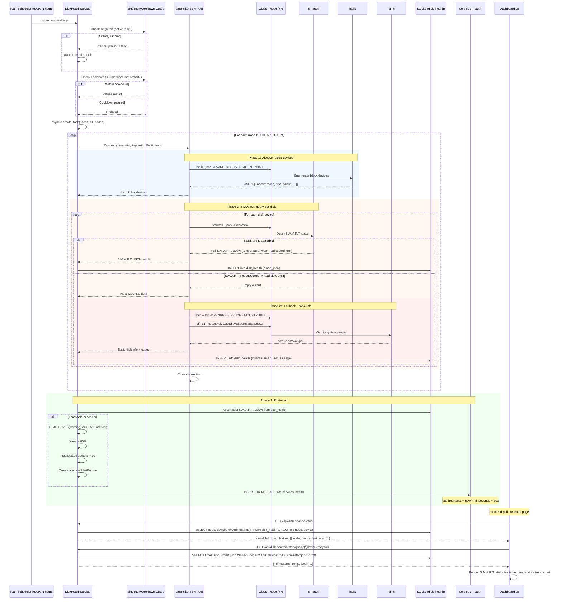

# Disk Health Scan Flow

> Automated S.M.A.R.T. disk health monitoring across all 7 cluster nodes via SSH.

## Cluster Nodes

| Node | IP | Disk | Mount |
|------|----|------|-------|
| st95101 | `10.10.95.101` | 1.8 TB | `/data/dc03` |
| st95102 | `10.10.95.102` | 1.8 TB | `/data/dc03` |
| st395103 | `10.10.95.103` | 1.8 TB | `/data/dc03` |
| st395104 | `10.10.95.104` | 1.8 TB | `/data/dc03` |
| st395105 | `10.10.95.105` | 1.8 TB | `/data/dc03` |
| st395106 | `10.10.95.106` | 1.8 TB | `/data/dc03` |
| st395107 | `10.10.95.107` | 1.8 TB | `/data/dc03` |

All nodes are Intel N150 2-core, 3.9 GB RAM, running `weed` with 30 GB volumes on XFS.

## Configuration

| Setting | Default | Source |
|---------|---------|--------|
| `DISK_HEALTH_ENABLED` | `false` | `.env` |
| `DISK_HEALTH_SCAN_INTERVAL_HOURS` | `24` | `runtime_settings` |
| `DISK_HEALTH_SSH_USER` | `root` | `.env` |
| `DISK_HEALTH_SSH_KEY_PATH` | `~/.ssh/id_rsa` | `.env` |
| `DISK_HEALTH_TEMP_WARN_C` | `55` | `runtime_settings` |
| `DISK_HEALTH_TEMP_CRIT_C` | `65` | `runtime_settings` |
| `DISK_HEALTH_WEAR_WARN_PCT` | `85` | `runtime_settings` |
| `DISK_HEALTH_REALLOC_WARN_COUNT` | `10` | `runtime_settings` |

## Full Scan Sequence



## Step-by-Step Explanation

### 1. Singleton and Cooldown Guard

Before starting a scan, `DiskHealthService` enforces two safety checks:

- **Singleton enforcement** (`_instance_count`): Only one live `_scan_loop` task at a time. If `start()` is called while a task is already running, the previous task is cancelled and awaited before creating a new one.
- **Cooldown check** (`_last_restart_at`): Refuses restarts within 300 seconds of the last `start()` call, preventing rapid start/stop cycles.

### 2. Device Discovery (lsblk)

For each of the 7 nodes, the service:
1. Opens an SSH connection via paramiko using `DISK_HEALTH_SSH_USER` and `DISK_HEALTH_SSH_KEY_PATH` (10s timeout).
2. Runs `lsblk --json -o NAME,SIZE,TYPE,MOUNTPOINT` to discover all block devices.
3. Filters for devices with `type: "disk"` (e.g., `sda`, `nvme0n1`).

### 3. S.M.A.R.T. Query (smartctl)

For each discovered disk device, the service runs:
```bash
smartctl --json -a /dev/sda
```

The JSON output is stored raw in `disk_health.smart_json` for later parsing. Key fields extracted at query time:

| S.M.A.R.T. Attribute | Meaning | Threshold |
|----------------------|---------|-----------|
| `temperature.current` | Current drive temperature (°C) | Warn > 55, Critical > 65 |
| `ata_smart_attributes.table[*].value` | Wear leveling / endurance | Warn > 85% |
| `power_on_hours` | Total powered-on time | Informational |
| `reallocated_sector_ct` | Number of remapped bad sectors | Warn > 10 |

### 4. Fallback for Non-S.M.A.R.T. Disks

When `smartctl` returns no output (common for virtual disks, some NVMe drives, or LVM-backed storage), the service falls back to:

```bash
lsblk --json -b -o NAME,SIZE,TYPE,MOUNTPOINT
df -B1 --output=size,used,avail,pcent /data/dc03
```

A minimal `smart_json` record is constructed with:
- `model_name: "Virtual Disk"`
- `user_capacity` from `lsblk` size
- `smart_status.passed: true`
- `usage` object from `df` (total_gb, used_gb, avail_gb, pct)

Only disks with a `/data` mount point or ≥ 100 GB capacity are persisted (filters out boot/system partitions).

### 5. Threshold Evaluation & Alerting

After each scan, the service evaluates the latest S.M.A.R.T. data against thresholds. Alerts are created via the alert engine when any threshold is exceeded. Alerts remain open until the condition clears and the alert is acknowledged/resolved.

### 6. Heartbeat

After each successful scan cycle, the service writes to `services_health`:
- `name`: `"disk_health"`
- `last_heartbeat`: current timestamp
- `ttl_seconds`: `300` (5 minutes — slow service)

The `/api/health` endpoint reports this heartbeat so operators can see if the scan service is alive.

### 7. Manual Scan Trigger

Admins can trigger an immediate scan without waiting for the interval:
```
POST /api/disk-health/scan
```
This creates a new `asyncio.create_task` that runs `_scan_all_nodes()` once (not blocking the interval loop).

## Data Storage

The `disk_health` table schema:

```sql
CREATE TABLE disk_health (
    id INTEGER PRIMARY KEY AUTOINCREMENT,
    node TEXT NOT NULL,       -- e.g. "10.10.95.101"
    device TEXT NOT NULL,     -- e.g. "/dev/sda"
    timestamp REAL NOT NULL,  -- Unix epoch
    smart_json TEXT NOT NULL  -- Full S.M.A.R.T. JSON or fallback struct
);
```

No automatic cleanup — rows accumulate indefinitely. Historical data is queried by timestamp range via the API.

## API Reference

| Endpoint | Method | Description |
|----------|--------|-------------|
| `/api/disk-health/status` | GET | List all devices and their last scan timestamps |
| `/api/disk-health/scan` | POST | Trigger immediate scan (admin) |
| `/api/disk-health/{node}/{device}` | GET | Latest S.M.A.R.T. data for a device |
| `/api/disk-health/history/{node}/{device}?days=30` | GET | Temperature and wear trend over time |

## Troubleshooting

| Symptom | Cause | Fix |
|---------|-------|-----|
| All nodes return "no S.M.A.R.T." | SSH key path wrong or key not authorized | Verify `~/.ssh/id_rsa` exists and is in each node's `authorized_keys` |
| Single node fails | Node unreachable or `smartctl` not installed | Check network, verify `smartmontools` package is installed |
| Service stops after startup | `DISK_HEALTH_ENABLED=false` | Set `true` in `.env`, restart backend |
| Scan triggers but no data | Interval not elapsed yet | Use `POST /api/disk-health/scan` for immediate scan |
