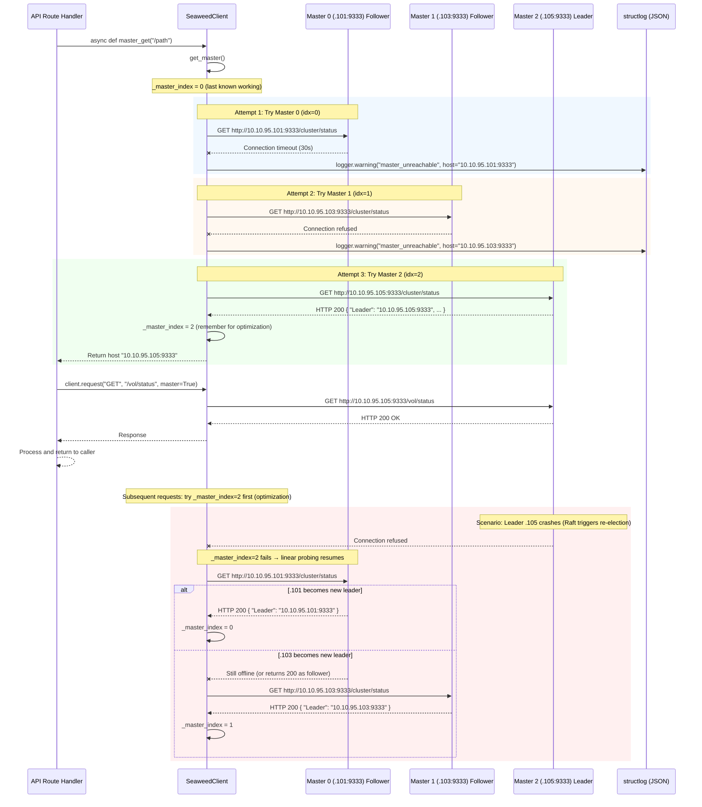

# Master Failover Flow

> Automatic multi-master failover with Raft consensus. The dashboard backend loops through all master nodes on connection failure, ensuring uninterrupted API access.

## Master Topology

```
┌──────────────────────────────────────────────────────────┐
│                  SeaweedFS dc03 Cluster                   │
│                                                          │
│  ┌─────────────────────┐                                 │
│  │ 10.10.95.105:9333   │ ◄── Raft Leader (elected)       │
│  │ st395105.mbm.mn     │      All writes forwarded here   │
│  └─────────┬───────────┘                                 │
│            │ (gRPC :19333)                               │
│  ┌─────────┼───────────┐                                 │
│  │         │           │                                 │
│  ▼         ▼           ▼                                 │
│  ┌───────────┐ ┌───────────┐                             │
│  │ .101:9333 │ │ .103:9333 │   Raft Followers            │
│  │ Follower  │ │ Follower  │   (can serve reads)         │
│  └───────────┘ └───────────┘                             │
└──────────────────────────────────────────────────────────┘
```

| Master | IP:Port | Hostname | Raft Role |
|--------|---------|----------|-----------|
| Master 0 | `10.10.95.101:9333` | st95101 | Follower |
| Master 1 | `10.10.95.103:9333` | st395103 | Follower |
| Master 2 | `10.10.95.105:9333` | st395105 | **Leader** (elected) |

**Config**: `SEAWEEDFS_MASTER_HOSTS=10.10.95.101:9333,10.10.95.103:9333,10.10.95.105:9333` in `.env` → parsed by `config.py` → `settings.master_list`.

## Failover Sequence



## Step-by-Step Explanation

### 1. Master List Configuration

The `SEAWEEDFS_MASTER_HOSTS` environment variable is a comma-separated CSV string parsed by `config.py`:

```python
# config.py
@property
def master_list(self) -> list[str]:
    return [h.strip() for h in self.seaweedfs_master_hosts.split(",") if h.strip()]
```

This produces `["10.10.95.101:9333", "10.10.95.103:9333", "10.10.95.105:9333"]`.

**Single source of truth**: The CSV only lives in `.env`. The backend and frontend both derive master hosts from this single value. The frontend reads cluster info via `/api/info` endpoint.

### 2. SeaweedClient.get_master()

Every API call to a master endpoint goes through `get_master()` first:

```python
async def get_master(self) -> str:
    masters = settings.master_list
    for attempt in range(len(masters)):
        idx = (self._master_index + attempt) % len(masters)
        host = masters[idx]
        try:
            resp = await self.client.get(f"http://{host}/cluster/status")
            if resp.status_code == 200:
                self._master_index = idx   # ← remember for next time
                return host
        except Exception:
            self.logger.warning("master_unreachable", host=host, exc_info=True)

    self.logger.error("all_masters_failed", masters=masters)
    raise RuntimeError("No reachable master")
```

**Round-robin probing**: Starting from `_master_index` (the last known working master), each successive master is tried. The modulo ensures it wraps around.

**Optimization**: On success, `_master_index` is updated so the next request tries that master first — reducing latency under normal conditions.

### 3. All-Masters-Failed Scenario

If `get_master()` exhausts all hosts without a 200 response:
- A structlog `ERROR` is emitted with all master hosts for debugging.
- A `RuntimeError("No reachable master")` is raised.
- The calling route handler catches this and returns an error to the client (typically HTTP 502).

The dashboard frontend displays a "Cluster Unreachable" banner when all masters are down.

### 4. Request Routing (`client.request()`)

All master API calls use the shared `request()` method:

```python
async def request(self, method, path, *, master=True, **kwargs) -> httpx.Response:
    base = await self.get_master() if master else await self.get_filer()
    url = f"http://{base}{path}"
    resp = await self.client.request(method, url, **kwargs)
    resp.raise_for_status()
    return resp
```

**Key behaviors:**
- `master=True` → calls `get_master()` → returns whichever master is reachable.
- `master=False` → calls `get_filer()` (identical failover pattern for filer hosts).
- `raise_for_status()` fails hard on non-2xx, logging the full URL and method via structlog.

### 5. Read vs Write Routing

| Operation | Role | Explanation |
|-----------|------|-------------|
| `GET /dir/status` | Any master | Read operations are stateless — any follower can serve |
| `GET /vol/status` | Any master | Follower returns cached state from last heartbeat |
| `POST /vol/grow` | **Leader only** | Write operations mutate state → Raft forwards to leader |
| `POST /vol/vacuum` | **Leader only** | Vacuum trigger is a state change |

SeaweedFS Raft handles the read/write split automatically:
- The SeaweedFS master process receives the request regardless of which node it hits.
- If a follower receives a write, it internally **forwards to the leader** via gRPC (port `19333`) — transparent to the client.
- The dashboard backend does **not** need to know which node is the leader; it can send any request to any reachable master.

### 6. Retry & Backoff Strategy

The current implementation uses **linear probing** (one attempt per master, in sequence) with httpx's configurable timeout (`SEAWEEDFS_REQUEST_TIMEOUT`, default 30s).

**No exponential backoff in the client itself** — each `get_master()` call probes all masters linearly. However, repeated calls from different route handlers benefit from `_master_index` remembering the last working master.

### 7. Logging & Observability

Every failover event is logged with full context:

```json
{
  "event": "master_unreachable",
  "level": "warning",
  "host": "10.10.95.101:9333",
  "exception": "ConnectionRefusedError: ..."
}
```

If all masters fail:
```json
{
  "event": "all_masters_failed",
  "level": "error",
  "masters": ["10.10.95.101:9333", "10.10.95.103:9333", "10.10.95.105:9333"]
}
```

### 8. Raft Re-Election (Who Triggers)

Raft leader election is handled **entirely by SeaweedFS**, not the dashboard:
- Masters communicate on port `19333` (gRPC).
- If the leader becomes unreachable, followers hold an election.
- The new leader sends a heartbeat to announce itself.
- During the election window (~1-2 seconds), API requests may fail transiently.
- The dashboard's `get_master()` linear probing naturally tolerates this — it tries the next master.

### 9. Circuit Breaker (Future Enhancement)

The AGENTS.md design spec calls for a circuit breaker after 3 consecutive failures with 30s cooldown. This is **not yet implemented** in the current codebase. The current approach relies on:
- `_master_index` optimization to avoid repeatedly hitting a dead master.
- Full master-list retry on each call (no persistent state tracking "dead" masters).
- Per-request timeout (30s) from httpx to bound latency.

## Filer Failover (Same Pattern)

The `get_filer()` method follows the identical pattern for filer hosts:

```
SEAWEEDFS_FILER_HOST=10.10.95.102:8888,10.10.95.104:8888
```

Filers in the `ha` group share the same underlying volume storage — either can serve reads and writes. The dashboard probes both, remembers the last working one via `_filer_index`, and fails over identically.

## API Resilience Summary

| Failure Scenario | Behavior | Dashboard Impact |
|-----------------|----------|------------------|
| 1 master down | Probe next master (≤ 1 timeout) | Brief delay, request succeeds |
| 2 masters down | Probe last master (≤ 2 timeouts) | Longer delay, request succeeds |
| All 3 masters down | `RuntimeError("No reachable master")` | Dashboard shows "Cluster Unreachable" |
| Leader crash + election | Probe followers, Raft forwards internally | Transparent — may see brief delay during election |
| Network partition | Probe each master, all time out | Total fail — all-masters-failed error |

## Verification Commands

```bash
# Check which master is the Raft leader
curl -s http://10.10.95.105:9333/cluster/status | python3 -m json.tool

# Check topology from any master
curl -s http://10.10.95.101:9333/dir/status?pretty=y | python3 -m json.tool

# Dashboard health endpoint (reports master connectivity)
curl -s http://10.10.0.80:8081/api/health | python3 -m json.tool
```
