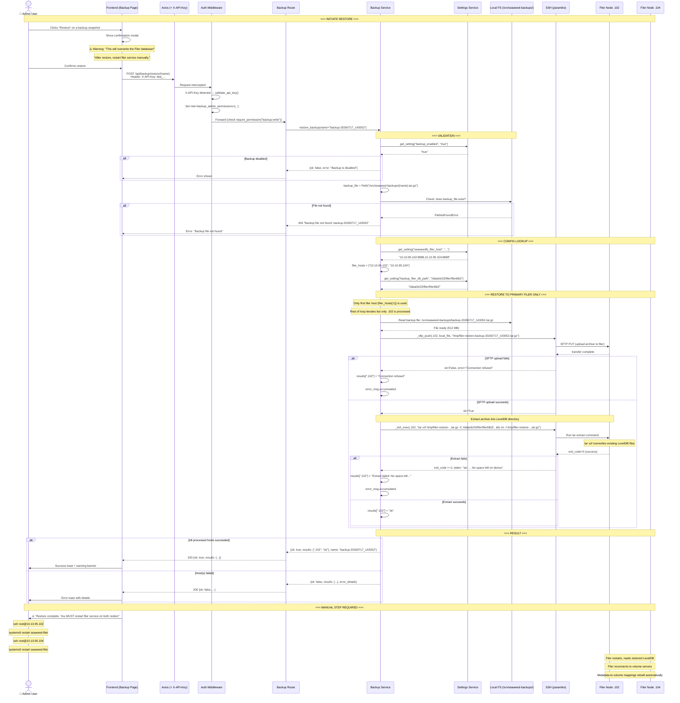
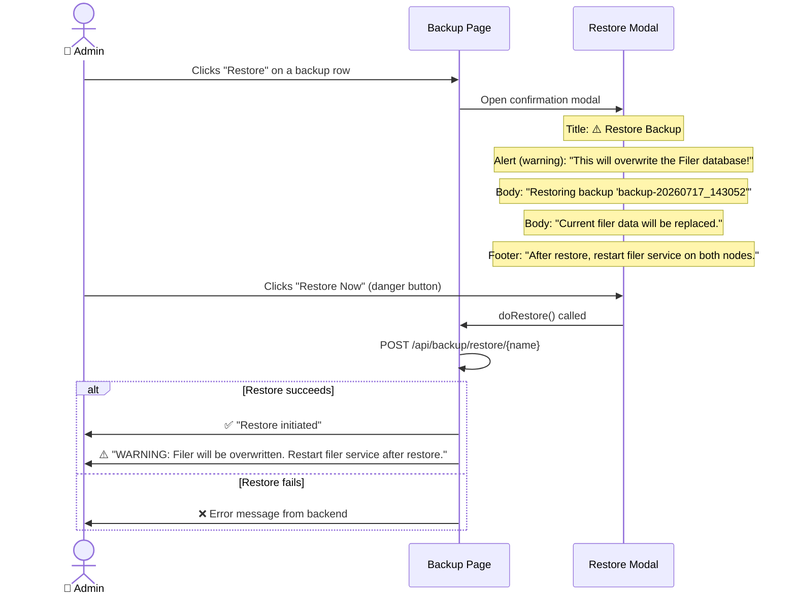

# Restore Flow

## Overview

The restore operation takes a previously created backup (a `.tar.gz` archive of the filer's LevelDB metadata) and pushes it back to the filer nodes, overwriting the current filer database. This is a **destructive operation** — the current filer metadata is fully replaced. After restore, the filer service must be manually restarted for changes to take effect.

The filer LevelDB contains only metadata (file names, paths, sizes, permissions, directory structure). File content resides on volume servers and is not affected by this operation. After a restore and filer restart, the filer reconnects to existing volumes and rebuilds its metadata-to-volume mappings.

## Restore Sequence



## Why Only the Primary Filer?

The restore logic (`restore_backup` in `backup_service.py`) restores to **only the first filer host** (`filer_hosts[:1]`). This is because:

1. Both filer nodes (`10.10.95.102` and `10.10.95.104`) are in an HA group (`ha`, `filerGroup=ha`)
2. They synchronize metadata via gRPC peer sync on port `18888`
3. After restoring one node and restarting both, the peer sync replicates the restored data to the other node

## Why Filer Restart is Required

The filer reads its LevelDB database at startup and keeps it in memory (with periodic flushes). Simply overwriting the LevelDB files on disk while the filer is running:

1. Does not reload the in-memory data structures
2. May cause corruption if the filer writes to the database concurrently
3. Leaves stale in-memory state that contradicts the new on-disk state

After a restart (`systemctl restart seaweed-filer`), the filer:
1. Reads the restored LevelDB from disk
2. Loads all file/directory metadata into memory
3. Reconnects to the volume servers to rebuild chunk-to-volume mappings
4. Resumes normal operation with the restored metadata

## Why Metadata-Only Restore Works

The filer LevelDB stores **metadata only**:

| Stored in LevelDB | NOT stored in LevelDB |
|---|---|
| File names and paths | File content (bytes) |
| File sizes | Chunk data |
| Permissions and owners | Volume-to-chunk mappings (built at runtime) |
| Timestamps (mtime, ctime) | |
| Directory structure | |
| Extended attributes | |

When the filer restarts with restored metadata, it:
1. Scans the volume servers it knows about (`weed filer -peers` or master-announced)
2. Finds which volumes hold which file chunks
3. Rebuilds the in-memory mapping that routes file requests to the correct volume servers

This means file content is never lost during a filer restore — it stays on the volume servers. The restore only recovers the "index" (metadata) that tells the filer where everything is.

## Restore Confirmation (Frontend)



The confirmation modal uses Ant Design's `Modal` with:
- `okButtonProps={{ danger: true }}` — red danger button to emphasize destructive action
- `ExclamationCircleOutlined` icon for visual warning
- Explicit mention of the filer restart requirement

## Error Handling

| Failure Point | Behavior |
|---|---|
| Backup file missing | `FileNotFoundError` → HTTP `404` "Backup file not found: {name}" |
| `backup_enabled` is false | Returns `{ok: false, error: "Backup is disabled"}` |
| SFTP upload fails | Host marked as failed in results. Error message recorded. |
| `tar xzf` fails (disk full, permissions) | `RuntimeError("Extract failed: ...")` with stderr excerpt |
| SSH connection fails | Host marked as failed. Error message recorded. |
| All filers fail | `ok: false` returned with aggregated error messages |

## Full Filer Restore Procedure (Operator Checklist)

1. **Pre-flight**: Verify backup file exists: `ls -lh /srv/seaweed-backups/{name}.tar.gz`
2. **Dashboard**: Navigate to Backup page, click Restore on desired snapshot
3. **Confirm**: Read warning, click "Restore Now"
4. **Wait**: SFTP upload + extract typically takes 1-5 minutes depending on DB size
5. **Restart filers**:
   ```bash
   ssh root@10.10.95.102 systemctl restart seaweed-filer
   ssh root@10.10.95.104 systemctl restart seaweed-filer
   ```
6. **Verify**: Check filer is responding:
   ```bash
   curl -s http://10.10.95.102:8888/ | head
   ```
7. **Monitor**: Watch filer logs for peer sync and volume reconnection:
   ```bash
   ssh root@10.10.95.102 journalctl -u seaweed-filer -f
   ```
