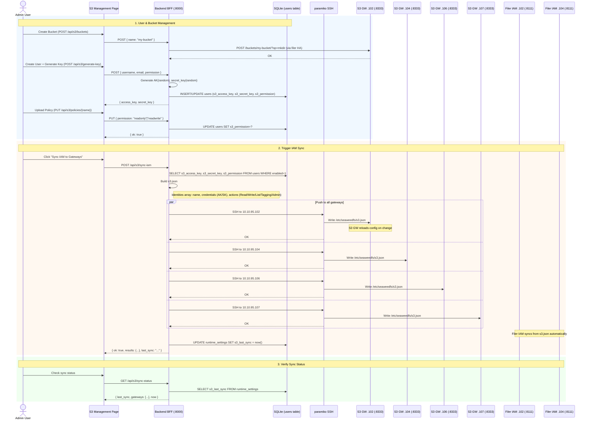

# S3 IAM Sync Flow

> S3 Identity and Access Management propagation from the Dashboard to all S3 Gateway nodes and the embedded Filer IAM service.

## Architecture Overview

```
Dashboard (Admin UI)
    │
    ▼
Backend BFF (FastAPI :8000)
    │  reads/writes
    ▼
SQLite (users table: s3_access_key, s3_secret_key, s3_permission)
    │  generates
    ▼
/etc/seaweedfs/s3.json  ─── SSH push via paramiko ──►  .102:8333
                                                    ►  .104:8333
                                                    ►  .106:8333
                                                    ►  .107:8333
                                              (S3 Gateway ports)
                                                    
                                                    ►  .102:8111
                                                    ►  .104:8111
                                              (Filer IAM embedded)
```

## S3 Gateway Nodes

| Node | S3 Port | Filer IAM Port | Role |
|------|---------|----------------|------|
| `10.10.95.102` | `8333` | `8111` | Filer + S3 GW |
| `10.10.95.104` | `8333` | `8111` | Filer + S3 GW |
| `10.10.95.106` | `8333` | — | Volume + S3 GW |
| `10.10.95.107` | `8333` | — | Volume + S3 GW |

Filer HA group: `ha` (`.102` and `.104` are peers).

## Full Sync Flow



## Step-by-Step Workflow

### 1. Create Bucket (`POST /api/s3/buckets`)

The dashboard creates buckets via the **Filer API** (not direct S3), because SeaweedFS S3 buckets are simply directories on the filer:

```
POST /buckets/{name}/?op=mkdir
```

The request is sent to whichever filer is reachable (failover across `.102`, `.104`). Both filers share the same underlying volume storage, so the bucket is immediately available on all S3 gateways.

### 2. Generate Key (`POST /api/s3/generate-key`)

Creates or updates an S3 user in the local SQLite database:

- **Access key**: `AK` + 20 hex chars (via `secrets.token_hex(10)`)
- **Secret key**: 40 hex chars (via `secrets.token_hex(20)`)
- **Permission**: `readonly` or `readwrite`

If the username doesn't exist in the `users` table, a new user row is created with role `viewer` and a random password hash (for dashboard login). If the user exists, only the S3 fields are updated.

### 3. Upload Policy (`PUT /api/s3/policies/{name}`)

Each user has a single permission level stored in `users.s3_permission`:

| Permission | S3 Actions |
|------------|-----------|
| `readonly` | `Read`, `List` |
| `readwrite` | `Read`, `Write`, `List`, `Tagging`, `Admin` |

The policy name follows the convention `user-{username}`. Policies are stored in the `users` table (no separate policy table) and are materialized into `s3.json` only at sync time.

### 4. Sync IAM to Gateways (`POST /api/s3/sync-iam`)

This is the critical propagation step. The backend:

1. **Gathers** all enabled users with S3 keys from `users` table.
2. **Builds** a complete `s3.json` document:

```json
{
  "version": 1,
  "identities": [
    {
      "Name": "alice",
      "Credentials": [{ "AccessKey": "AKabc123...", "SecretKey": "def456..." }],
      "Actions": ["<YOUR_PERMISSION>"]
    }
  ],
  "accounts": [],
  "updatedAt": "2026-07-17T10:00:00Z"
}
```

3. **SSH-pushes** the file via paramiko to `/etc/seaweedfs/s3.json` on **all four** gateway hosts.
4. Writes the sync timestamp to `runtime_settings` table (key `s3_last_sync`).

**Precondition**: The sync requires `disk_health_enabled=True` in `.env`, because the SSH key path and user credentials are shared with the disk health scan infrastructure. If disabled, the sync returns `{ skipped: true }`.

### 5. Check Sync Status (`GET /api/s3/sync-status`)

Returns:
- `last_sync`: ISO timestamp of the most recent successful sync (or `null` if never synced).
- `gateways`: List of all target gateway IPs.
- `now`: Current server time for drift comparison.

Status is not checked against actual gateway configs (no read-back verification); the timestamp reflects the last **push attempt**.

### 6. Filer HA Coordination

The Filer IAM embedded service (port `8111` on `.102` and `.104`) reads the same `/etc/seaweedfs/s3.json`. Both filers belong to the `ha` filer group, meaning:
- S3 auth requests from any gateway are routed to whichever filer is active.
- If `.102` is the active filer, S3 auth is served by its IAM service.
- On failover to `.104`, the IAM service on `.104` takes over using the same `s3.json`.
- This is why pushing to **all** gateways (not just the active one) is important.

## S3 API Usage Examples

```bash
# List buckets (any gateway)
aws s3 ls --endpoint-url=http://10.10.95.102:8333

# Create a bucket
aws s3api create-bucket \
  --bucket my-data \
  --endpoint-url=http://10.10.95.102:8333

# Upload a file
aws s3 cp report.pdf s3://my-data/reports/ \
  --endpoint-url=http://10.10.95.102:8333

# List with credentials from dashboard
export AWS_ACCESS_KEY_ID=AKabc123def456...
export AWS_SECRET_ACCESS_KEY=abc123def456...
```

## API Reference

| Endpoint | Method | Permission | Description |
|----------|--------|------------|-------------|
| `/api/s3/buckets` | GET | — | List all S3 buckets |
| `/api/s3/buckets` | POST | `s3:write` | Create a new bucket |
| `/api/s3/buckets/{name}` | DELETE | `s3:write` | Delete a bucket (recursive) |
| `/api/s3/buckets/{name}/quota` | PUT | `s3:write` | Set hard quota (bytes) |
| `/api/s3/users` | GET | — | List users with S3 credentials |
| `/api/s3/users/{id}/credentials` | POST | `s3:write` | Regenerate access/secret key |
| `/api/s3/users/{id}/reveal-secret` | POST | admin | Reveal secret key (requires admin password) |
| `/api/s3/generate-key` | POST | `s3:write` | Create user + generate S3 key pair |
| `/api/s3/policies` | GET | — | List user policies |
| `/api/s3/policies/{name}` | PUT | `s3:write` | Update user permission |
| `/api/s3/sync-iam` | POST | `s3:write` | Push s3.json to all gateways |
| `/api/s3/sync-status` | GET | — | Get last sync timestamp |

## Troubleshooting

| Symptom | Likely Cause | Fix |
|---------|-------------|-----|
| Sync returns `{ skipped: true }` | `disk_health_enabled=False` | Set `DISK_HEALTH_ENABLED=true` in `.env` and restart backend |
| Sync returns `{ results: { "10.10.95.106": false } }` | SSH key not authorized on that node | Verify `~/.ssh/id_rsa` is in `authorized_keys` on the node |
| Keys work on one gateway but not another | `s3.json` out of sync on that node | Trigger sync again (`POST /api/s3/sync-iam`) |
| S3 operations return 403 after sync | S3 GW didn't reload config | Restart `seaweed-s3` service on affected node |
| Bucket creation fails | Filer unreachable | Check `SEAWEEDFS_FILER_HOST` in `.env`, verify filer HA status |
