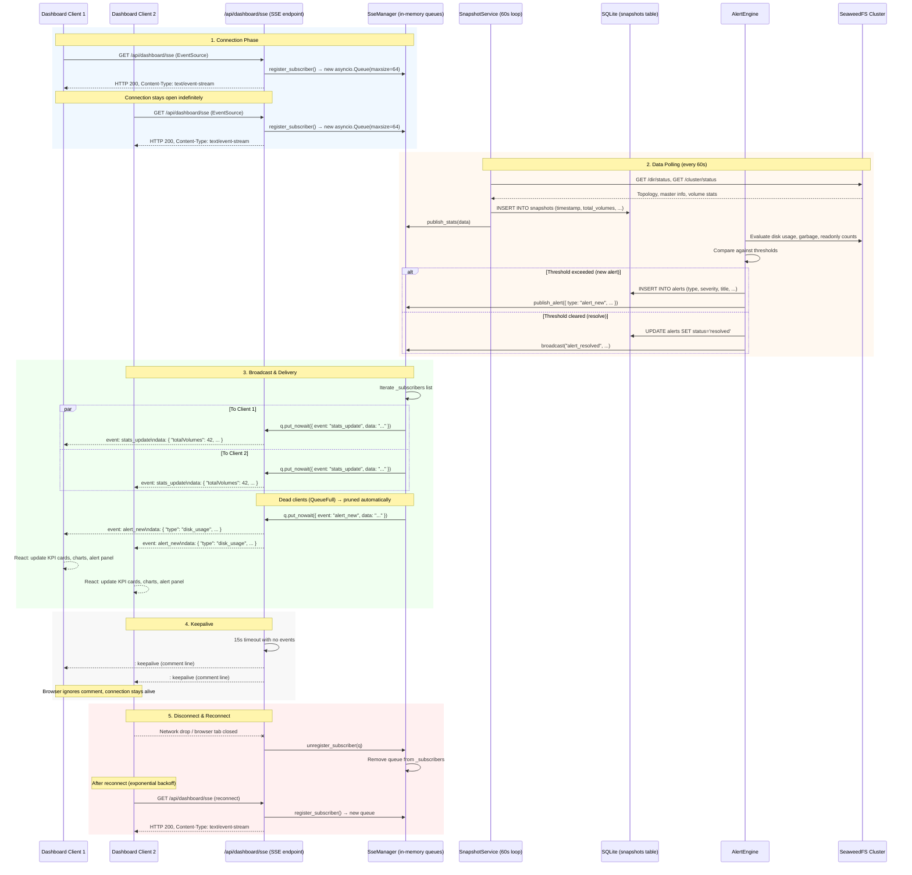

# SSE Real-Time Data Flow

> Server-Sent Events (SSE) architecture for pushing live cluster data to all connected dashboard clients.

## Architecture Overview

```
┌──────────────────────────────────────────────────┐
│                   Backend (FastAPI)               │
│                                                   │
│  ┌─────────────────┐     ┌─────────────────────┐  │
│  │ SnapshotService  │     │    AlertEngine       │  │
│  │ (polls /60s)     │     │ (evaluates thresholds)│  │
│  └────────┬────────┘     └──────────┬──────────┘  │
│           │                         │              │
│           ▼                         ▼              │
│  ┌──────────────────────────────────────────────┐  │
│  │            SseManager (broadcast)            │  │
│  │                                              │  │
│  │  _subscribers: [Queue, Queue, Queue, ...]   │  │
│  └────────────────────┬─────────────────────────┘  │
│                       │                            │
│  ┌────────┐  ┌────────┐  ┌────────┐               │
│  │Client 1│  │Client 2│  │Client 3│  ...           │
│  └────────┘  └────────┘  └────────┘               │
│    SSE         SSE         SSE                     │
└──────────────────────────────────────────────────┘
```

| Component | Interval | Role |
|-----------|----------|------|
| `SseManager` | On-demand | Registers clients, broadcasts events |
| `SnapshotService` | Every 60s | Polls cluster, stores to SQLite, triggers `publish_stats` |
| `AlertEngine` | Every 60s | Evaluates thresholds, sends `alert_new`/`alert_acknowledged`/`alert_resolved` |
| `Dashboard stats endpoint` | On GET | Immediately publishes latest stats via SSE |

## Full Sequence



## Step-by-Step Explanation

### 1. Client Connection

The frontend initializes an `EventSource` pointed at `/api/dashboard/sse`:

```typescript
const source = new EventSource('/api/dashboard/sse', { withCredentials: true });
```

The backend (`routes/sse.py`) creates a **per-client `asyncio.Queue`** (max 64 messages) and registers it in the global `_subscribers` list. The response is an `EventSourceResponse` from the `sse-starlette` library — a streaming HTTP response with `Content-Type: text/event-stream`.

### 2. Data Polling & Publishing

**SnapshotService** (60s interval):
- Polls the master API (`/dir/status`, `/cluster/status`) once every 60 seconds (configurable via `SNAPSHOT_INTERVAL_SECONDS` in `runtime_settings`).
- Stores the raw stats into the `snapshots` SQLite table for historical queries.
- Calls `publish_stats(data)` which broadcasts to all connected clients.

**Dashboard stats endpoint** (`GET /api/dashboard/stats`):
- Also calls `publish_stats(stats)` at the end of processing, so even manual page loads push fresh data to SSE subscribers.

**AlertEngine** (60s interval):
- Evaluates cluster health against threshold values from `runtime_settings`.
- Creates new alerts (`INSERT INTO alerts`) or resolves existing ones (`UPDATE alerts SET status='resolved'`).
- Broadcasts `alert_new`, `alert_acknowledged`, or `alert_resolved` events.

### 3. Broadcast Mechanism

The `broadcast(event_type, data)` function:
1. Constructs a payload: `{ "event": event_type, "data": json.dumps(data) }`.
2. Iterates the `_subscribers` list.
3. Calls `q.put_nowait(payload)` for each queue.
4. If `asyncio.QueueFull` is raised (client too slow, queue backed up with 64 messages), the queue is pruned from the subscriber list.

**No Redis required**: The current implementation uses in-memory broadcasting only. If `REDIS_URL` is set in the future, broadcast can fan out via Redis pub/sub for multi-worker deployments.

### 4. Keepalive

The `event_generator` coroutine uses `asyncio.wait_for(q.get(), timeout=15.0)`. If no data arrives within 15 seconds, it yields a **comment line** (`: keepalive`). Comments in SSE are ignored by browsers but prevent proxies (nginx, Cloudflare) from closing idle connections.

### 5. Client Disconnect & Reconnect

**Disconnect**:
- When the `EventSource` is closed (tab closed, network drop), the `await request.is_disconnected()` check triggers.
- The generator's `finally` block calls `unregister_subscriber(q)`, removing the queue from `_subscribers`.

**Reconnect** (frontend logic):
- The browser's native `EventSource` automatically reconnects on connection loss.
- Reconnection uses **exponential backoff**: 1s → 2s → 4s → 8s → … → max 30s.
- This is handled by `EventSource` itself — no custom frontend logic needed for basic reconnect.

### SSE Event Types

| Event Type | Payload | Trigger |
|------------|---------|---------|
| `stats_update` | Full dashboard stats JSON | SnapshotService poll, dashboard stats API call |
| `alert_new` | Alert object (type, severity, title, description, node) | AlertEngine threshold exceeded |
| `alert_acknowledged` | Alert ID + timestamp | Admin acknowledges alert via UI |
| `alert_resolved` | Alert ID + timestamp | Condition clears, alert auto-resolved |
| `cluster_health` | Health status (healthy/degraded/critical) | Master status check, node count change |

### Frontend Integration

```typescript
const source = new EventSource('/api/dashboard/sse');

source.addEventListener('stats_update', (e) => {
  const data = JSON.parse(e.data);
  store.updateStats(data);  // Update Zustand store → re-render KPI cards, charts
});

source.addEventListener('alert_new', (e) => {
  const alert = JSON.parse(e.data);
  store.addAlert(alert);    // Add to alert panel, show toast notification
});
```

### Component Heartbeat Monitoring

The `/api/health` endpoint reports each background service's last heartbeat from `services_health` table. The SSE stream can also carry heartbeat events from components (future enhancement).

## API Reference

| Endpoint | Method | Auth | Description |
|----------|--------|------|-------------|
| `/api/dashboard/sse` | GET | Session (cookie) | Open SSE stream |
| `/api/dashboard/stats` | GET | Session | Get current stats (also publishes to SSE) |
| `/api/dashboard/history?hours=24` | GET | Session | Get historical snapshots |
| `/api/dashboard/alerts` | GET | Session | Get active alerts |
| `/api/dashboard/alerts/{id}/acknowledge` | PUT | Admin | Acknowledge an alert |
| `/api/dashboard/alerts/config` | GET | Session | Get alert thresholds |
| `/api/dashboard/alerts/config` | PUT | Admin | Update alert thresholds |

## Deployment Notes

- **Nginx proxy** must have `proxy_buffering off;` and `proxy_read_timeout 3600s;` for SSE passthrough.
- **Cloudflared tunnel** passes SSE cleanly (HTTP streaming is supported).
- **Single-worker** (uvicorn `--workers 1`): In-memory subscriber list is sufficient.
- **Multi-worker** (future): Requires Redis pub/sub for cross-worker broadcast.
