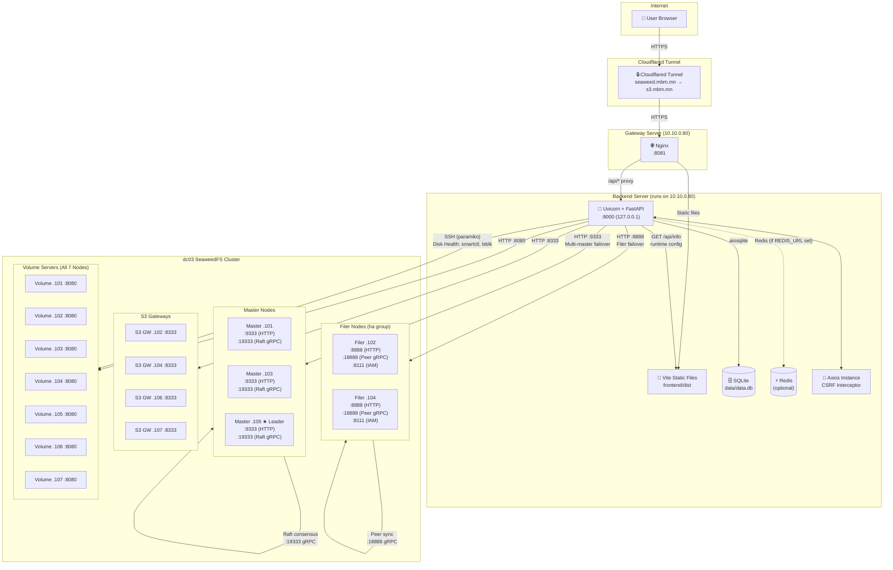

# System Architecture

## Overview

The SeaweedFS Dashboard is a web-based management interface for the **dc03 SeaweedFS cluster** at mBm TECHNOLOGY. It provides a unified UI for cluster monitoring, volume management, filer browsing, S3 bucket administration, backups, worker management, and disk health monitoring.

All value references below are sourced from a single configuration chain: `.env` → `config.py` (via pydantic-settings) → runtime. No values are hardcoded anywhere in the system.

## Architecture Diagram



## Component Descriptions

### 1. User Browser → Cloudflared Tunnel

External access flows through Cloudflared, which proxies `seaweed.mbm.mn` to the internal gateway at `10.10.0.80:8081`. The tunnel provides SSL termination and DDoS protection. All traffic is HTTPS-encrypted between the browser and Cloudflared's edge.

### 2. Nginx (Gateway — 10.10.0.80:8081)

Nginx serves a dual role on port `8081`:

| Path Pattern | Handler | Description |
|---|---|---|
| `/` (root) | Static files from `frontend/dist/` | Vite-built React SPA. `try_files` falls back to `index.html` for client-side routing. |
| `/api/*` | Reverse proxy → `127.0.0.1:8000` | All API requests proxied to the FastAPI backend. `proxy_buffering off` and `proxy_read_timeout 3600s` for SSE streams. |

Key headers forwarded: `Host`, `X-Forwarded-For`.

### 3. Frontend (React 19 + TypeScript + Ant Design 5)

The single-page application (SPA) is built with Vite and served as static assets. Core characteristics:

- **Axios instance** (`frontend/src/services/api.ts`): Singleton configured with `baseURL: '/api'`, `withCredentials: true` (session cookie), and two interceptors:
  - **Request interceptor**: Attaches `X-API-Key` header (when backup API key is stored in `localStorage`) and `X-CSRF-Token` header (for state-changing `POST`/`PUT`/`DELETE` requests).
  - **Response interceptor**: On `401` status, triggers automatic logout via `useAuthStore.getState().logout()` and redirects to `/login`.
- **Auth store** (Zustand): Persists `user` and `csrfToken` in `localStorage`, hydrated on page load.
- **Vite dev proxy** (port `5173`): Proxies `/api` → `localhost:8000` during development.

### 4. Backend (FastAPI + Uvicorn — 127.0.0.1:8000)

The BFF (Backend-For-Frontend) layer. Built with Python 3.11+ and FastAPI, it provides:

**Middleware stack** (applied in order):

| Order | Middleware | Purpose |
|---|---|---|
| 1 | `SlowAPIMiddleware` | Rate limiting (e.g., `20/5minute` on login). |
| 2 | `CORSMiddleware` | Allows requests from `localhost`, `127.0.0.1`, `10.10.x.x`, `seaweed.mbm.mn`. |
| 3 | `CsrfMiddleware` | Validates `X-CSRF-Token` header on all state-changing methods (`POST`, `PUT`, `DELETE`, `PATCH`) — except `/api/auth/*` paths. |
| 4 | `AuthMiddleware` | Resolves identity: API key (`X-API-Key` header) → `backup_admin` role with explicit permissions, or session cookie → role-based RBAC. |
| 5 | `SessionMiddleware` | Starlette's server-side sessions with `session_secret` from config. Cookies are `HttpOnly`, `SameSite=Lax`. |

**Core services**:

| Service | Responsibility |
|---|---|
| `SeaweedClient` | httpx async HTTP client with **multi-master failover loop**. Index-based round-robin across `[.101, .103, .105]` on failure. |
| `SnapshotService` | Periodic polling of cluster state → SQLite for trend charts. |
| `AlertEngine` | Threshold evaluation (disk > 90%, node offline, garbage > 0.5, readonly > N). |
| `backup_service` | SSH/SFTP backup and restore of filer LevelDB via paramiko. |
| `api_key_service` | API key generation (`bkp_` prefix + `secrets.token_hex(32)`), validation, usage recording, revocation. |
| `disk_health` | S.M.A.R.T. monitoring via paramiko SSH (`smartctl --json`, `lsblk --json`). |
| `settings_service` | Cached reads from `runtime_settings` SQLite table — single source of truth for all operational config. |

### 5. SQLite Database

Stored at `data/data.db` (path derived from `DATABASE_URL` env var). Uses `aiosqlite` with WAL mode and foreign keys enabled. Holds:

- `users` — bcrypt-hashed passwords, roles, profile info
- `api_keys` — generated keys with permissions, usage counters
- `backup_snapshots` — backup metadata and status
- `alerts` / `alert_config` — alert lifecycle and rules
- `runtime_settings` — operational config (thresholds, limits, intervals)
- `services_health` — component heartbeats
- `dashboard_snapshots` — historical data for charts

Schema migrations in `backend/migrations/` are applied automatically on startup via `database.py`.

### 6. Redis (Optional)

When `REDIS_URL` is set in `.env`, Redis is used for:
- **Session store** — replaces in-memory session storage
- **Rate limiting** — slowapi counter storage
- **SSE pub/sub** — cross-process Server-Sent Events

When `REDIS_URL` is unset, the system falls back to in-memory storage for sessions and rate limiting.

### 7. SeaweedFS Master API (:9333)

Three master nodes form a Raft consensus group (`.101`, `.103`, `.105`). `.105` is the currently elected leader. The dashboard communicates via HTTP to the Master API for:

- `/cluster/status` — cluster-wide status
- `/dir/status` — volume directory listings
- `/vol/grow`, `/vol/vacuum` — volume management
- `/col/delete` — collection management
- `/topo/status` — topology tree

**Failover loop**: `SeaweedClient.get_master()` iterates through the master list (`settings.master_list`), probing each in round-robin fashion. On first successful `GET /cluster/status` (200), that master is remembered and used for subsequent requests. If it fails, the next master is tried. If all fail, a `RuntimeError("No reachable master")` is raised.

### 8. SeaweedFS Filer API (:8888)

Two filer nodes in an HA group (`ha`, `filerGroup=ha`) at `.102` and `.104`. The dashboard communicates via HTTP for:

- `/` — filer directory listing (pagination, breadcrumb navigation)
- File upload/download/delete
- Directory create/delete

Filer peer sync runs on `:18888` (gRPC), and embedded IAM on `:8111`. Filer failover mirrors the master failover pattern in `SeaweedClient.get_filer()`.

### 9. S3 Gateway (:8333)

Four S3 gateway nodes (`.102`, `.104`, `.106`, `.107`) expose an S3-compatible API. The dashboard proxies S3 admin operations:

- Bucket CRUD
- User (access/secret key) management
- IAM policy CRUD (embedded in Filer IAM, synced to S3 gateways)
- IAM sync trigger

### 10. Volume Servers (:8080)

All seven nodes run volume servers exposing HTTP/gRPC on port 8080. The dashboard queries individual volume servers for:
- Volume status (`/stats/disk`)
- Per-volume detail (`/volume/status?volume=<id>`)

### 11. Disk Health via SSH (paramiko)

When `DISK_HEALTH_ENABLED=true`, the backend establishes SSH connections to all nodes using paramiko (key-based auth via `DISK_HEALTH_SSH_KEY_PATH`, default `~/.ssh/id_rsa`, user `root`). It runs:

- `smartctl --json /dev/sda` — S.M.A.R.T. attributes (temperature, wear, reallocated sectors)
- `lsblk --json` — block device listing and mount points

Results are stored in SQLite and exposed via `GET /api/disk-health/*` endpoints. Scheduled scans run at `DISK_HEALTH_SCAN_INTERVAL_HOURS` (default 24h).

## Data Flow Summary

```
Browser HTTPS → Cloudflared → Nginx :8081
  ├── / (static) → SPA loads → Axios /api/* requests
  └── /api/* → Uvicorn :8000
                ├── Auth (session / API key) → RBAC check
                ├── CSRF validation (state-changing only)
                ├── SeaweedClient → Master :9333 (failover) / Filer :8888 (failover)
                ├── SQLite (read/write operational data)
                ├── Redis (optional cache/sessions/SSE pub-sub)
                └── SSH (paramiko) → Volume nodes :22 (disk health)
```

## Protocol Summary

| Source | Target | Protocol | Port |
|---|---|---|---|
| Browser | Cloudflared | HTTPS (TLS) | 443 |
| Cloudflared | Nginx | HTTP | 8081 |
| Nginx | Uvicorn | HTTP (reverse proxy) | 8000 |
| Frontend (Axios) | Backend | HTTP (JSON) | /api/* |
| Backend | Master nodes | HTTP | 9333 |
| Backend | Filer nodes | HTTP | 8888 |
| Backend | S3 Gateway nodes | HTTP | 8333 |
| Backend | Volume nodes | HTTP | 8080 |
| Backend | All nodes | SSH (paramiko) | 22 |
| Master ↔ Master | gRPC (Raft) | 19333 |
| Filer ↔ Filer | gRPC (peer sync) | 18888 |
| Backend | SQLite | Local file I/O | — |
| Backend | Redis | TCP (RESP) | 6379 |
