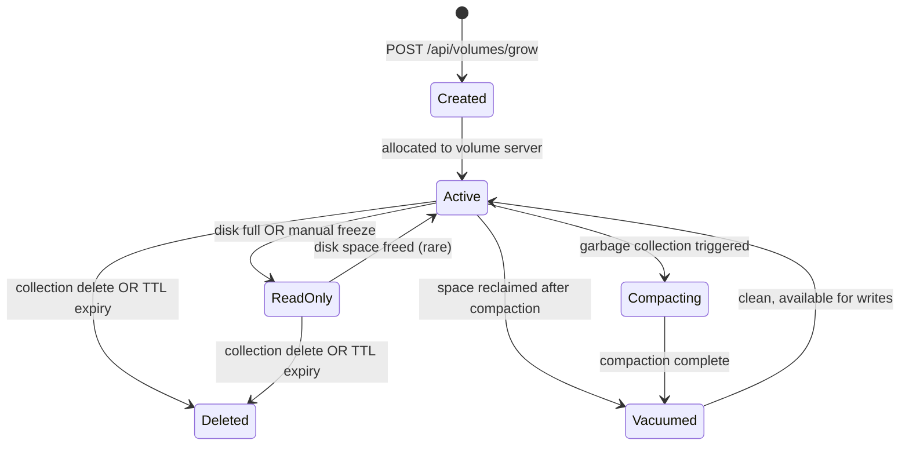
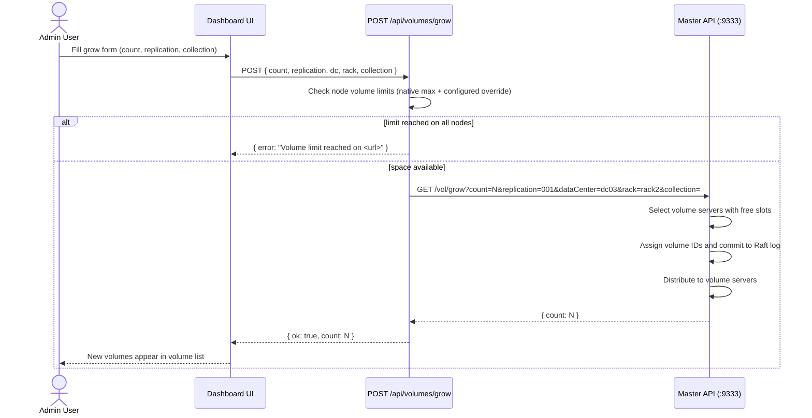
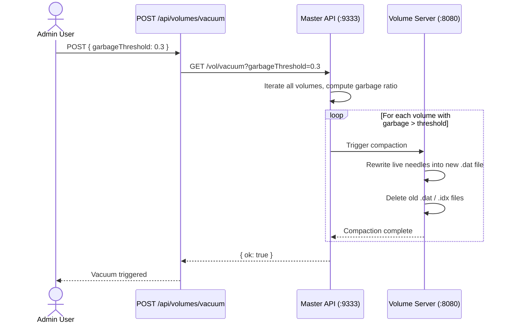
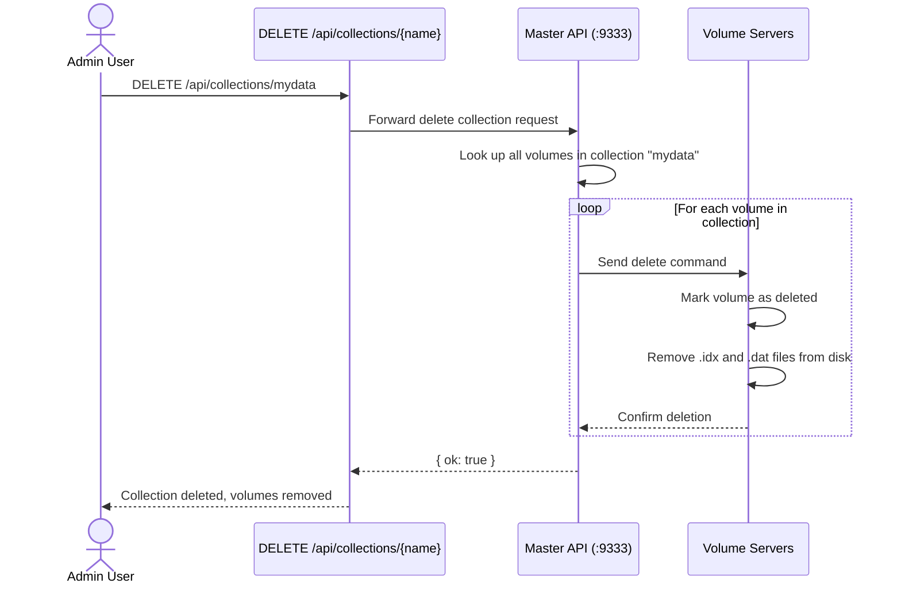

# Volume Lifecycle

> SeaweedFS volume state machine and management operations for the dc03 cluster.

## Cluster Context

| Parameter | Value |
|-----------|-------|
| Replication | `001` (primary + 1 replica → 2 copies total) |
| Volume size | 30 GB (configurable via `volume_size_mb` runtime setting) |
| Disk capacity per node | 1.8 TB XFS at `/data/dc03` |
| Max volumes per node | Native limit from `weed volume` plus optional `node_volume_limits` override |
| Node count | 7 volume servers (`.101`–`.107`) |

## State Diagram

## Step-by-Step Lifecycle

### 1. Volume Creation (Grow)

The **grow** operation allocates new volume slots across the cluster.

**Implementation detail** (`routes/volumes.py`, `POST /volumes/grow`):
1. Read topology from `GET /dir/status` to discover each node's `Max` (native) and current volume count.
2. Load `node_volume_limits` from runtime settings (JSON map of `url → limit`).
3. Compute `effective_max = min(native_max, configured_limit)` for each node.
4. If **any** node is at or above its effective max, the grow request is rejected.
5. Otherwise, forward `GET /vol/grow?count=…&replication=…` to the master.
6. The master assigns volumes round-robin across eligible nodes and replicates them per `001`.

### 2. Active State

Volumes in **Active** state accept reads and writes. The volume server:
- Stores files in 32 MB needle chunks within the `.idx` / `.dat` file pair.
- Accumulates garbage (deleted or overwritten chunks) over time.
- Reports status to the master every heartbeat (default ~5s).

### 3. Compaction (Garbage Collection)

When garbage ratio exceeds a threshold, the master triggers **vacuum**.

**Notes:**
- `garbageThreshold` is a float (e.g. `0.3` = 30% garbage).
- Vacuum is **non-blocking** — volumes remain available for reads during compaction.
- Compacted volumes return to the **Vacuumed** state then immediately become **Active** again (space reclaimed).

### 4. Read-Only State

A volume transitions to **ReadOnly** when:
- The underlying disk reaches its native filesystem full threshold.
- The `weed volume` process hits its configured `-max` volume count.
- An admin manually marks it read-only.

ReadOnly volumes:
- Still serve reads (lookups).
- Reject all write attempts.
- Can be deleted (see below).
- If disk space is freed, the master may re-enable writes.

### 5. Deletion (Collection Delete or TTL)

Volumes are deleted when:
- An entire **collection** is dropped (`DELETE /api/collections/{name}`).
- A **TTL** (time-to-live) configured at volume creation expires.
- Explicit admin action.

**Collection delete cascade:**

Deletion is **irreversible** — files are permanently removed from disk.

### 6. Vacuumed (Transient)

Immediately after compaction, the volume enters the **Vacuumed** state briefly. The volume server reports the updated (lower) used space to the master, which marks it `Active` again. This state is only observable during a narrow window between compaction finish and the next master heartbeat cycle.

## API Reference

| Endpoint | Method | Description |
|----------|--------|-------------|
| `/api/volumes` | GET | List all volumes across all nodes |
| `/api/volumes/{id}` | GET | Get single volume details |
| `/api/volumes/grow` | POST | Grow new volumes (admin) |
| `/api/volumes/vacuum` | POST | Trigger garbage collection (admin) |
| `/api/collections` | GET | List all collections |
| `/api/collections/{name}` | DELETE | Delete entire collection (admin) |

## Alerting

The alert engine monitors:
- **Garbage ratio** — triggers alert when any node has average garbage > `ALERT_GARBAGE_RATIO` (default 0.5).
- **Read-only count** — triggers alert when read-only volumes exceed `ALERT_MAX_READONLY_VOLUMES` (default 3).
- Latter threshold is configurable in the Settings UI → stored in `runtime_settings`.
